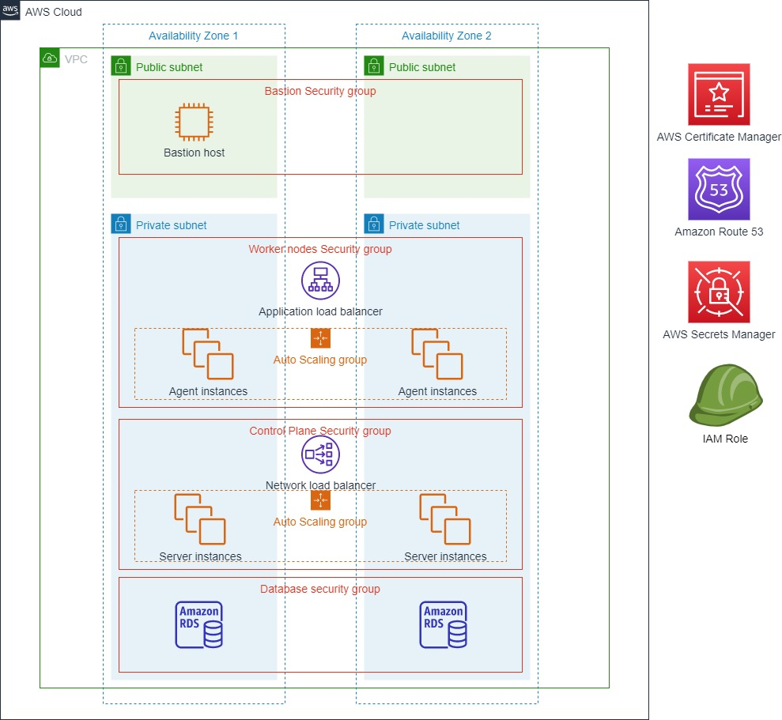
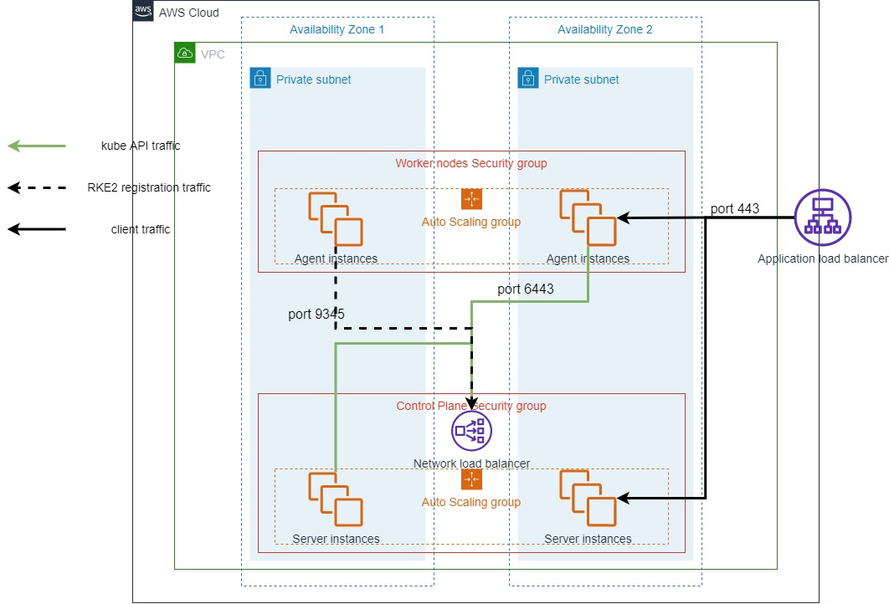
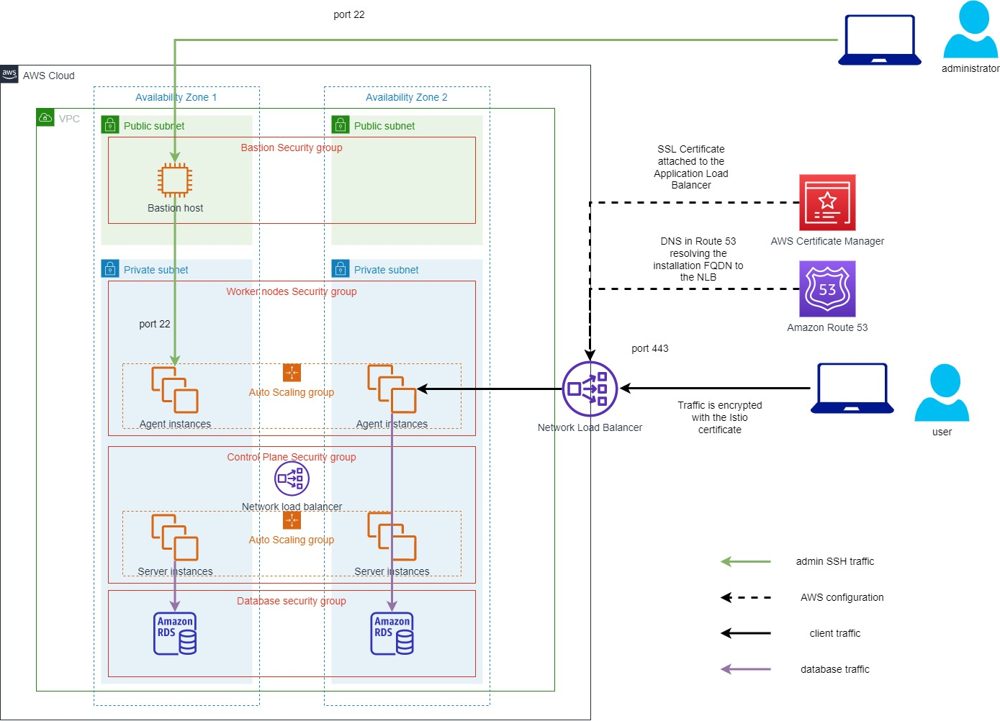

# UiPath Automation Suite on AWS quickstart

## Deployment

Deployment examples can be found [here](./deployment/index.md) 

## Architecture

The quickstart provisions all required infrastructure elements, configures them and then installs the UiPath Automation Suite on the EC2 instances.

## Components

Depending on the configuration being deployed, some components may not be provisioned. The total number of individual components is much larger and have been omitted for brevity.

## Implementation details

### CloudFormation templates

The deployment uses AWS CloudFormation stacks to aggregate infrastructure elements together. These stacks are aggregated, nesting them in higher level stacks to provide functionality.

The [ALB stack](../templates/alb.template.yaml) is nested inside the [Routing stack](../templates/routing.template.yaml) to provide the routing functionality.

### Routing

Client traffic on port 443, routed through the load balancer at the edge of the VPC, can be served by both server and agent instances. The client facing load balancer can be either an [Application Load Balancer](https://docs.aws.amazon.com/elasticloadbalancing/latest/application/introduction.html), or a [Network Load Balancer](https://docs.aws.amazon.com/elasticloadbalancing/latest/network/introduction.html).

Internally, an additional load balancer is deployed, to route kube-api and rke2 registration traffic. These requests can only be served by Server EC2 instances.

### EC2 instances

The compute used for the execution of the workloads are EC2 instances, deployed via AutoScaling groups. These are defined in the [Server stack](../templates/server.template.yaml) and fall into 2 major categories:
- Server instances
- Agent instances

The [Launch Templates](https://docs.aws.amazon.com/autoscaling/ec2/userguide/LaunchTemplates.html) provide both the configuration and the initialization procedure, which allows the EC2 instances to automatically configure and join the existing cluster.

### Configuration

Each installation requires a [cluster config json file](https://docs.uipath.com/automation-suite/docs/advanced-installation-experience#cluster_configjson-sample) containing all the configuration necessary to successfully join the existing cluster. The config file is stored as a secret in [AWS Secrets Manager](https://docs.aws.amazon.com/secretsmanager/latest/userguide/intro.html).   
